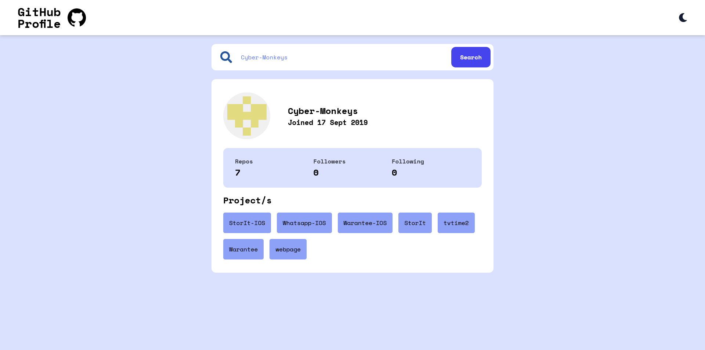
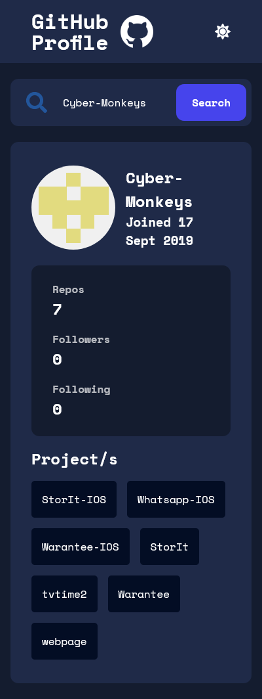

# Test Interview Project - Fidel Lim

## Table of contents

- [Overview](#overview)
  - [The challenge](#the-challenge)
  - [Built with](#built-with)
  - [Links](#links)
  - [Screenshot](#screenshot)
- [Intructions](#instructions)
  - [Setup Development](#setup-development)
  - [Test Project](#test-project)
  - [Run Project](#run-project)
  - [Deploy Project](#deploy-project)
- [Resources](#resources)
- [Author](#author)

## Overview

### The challenge

This test has been designed for you to show us your ability to design, code, test, and document a small service.

### Built with

- **Frontend** - React, SASS
- **Testing** - Lighthouse (Performance, Accessibility, Best Practices, SEO)
- **Other** - Docker

### Links

- GitHub Repo: [Repo](https://github.com/fidellim/Test-Project-1)
- Live Site URL: [Live Site](https://fidellim-test-project-1.netlify.app/)

### Screenshot






## Instructions

### Setup Development

To setup the project for development, please follow these steps:

1. Download my project as a [zip](https://github.com/fidellim/Test-Project-1) or clone my repository using this command `git clone https://github.com/fidellim/Test-Project-1.git`
2. Once you are on the directory of the project, install all dependencies:
   1. npm: `npm install`
   2. yarn: `yarn install`
3. After that you can start running the project in development server using this command:
   1. npm: `npm start`
   2. yarn: `yarn start`

### Test Project

If you would like to test the app's performance, accessibility, best practices, and SEO, there is Google Lighthouse.

Follow these steps to check the app's performance, accessibility, best practices, and SEO:

1. Use Google Chrome (Incognito Mode) to run the app. It is suggested to use Incognito window as Chrome extensions might negatively affect the page's/app's load performance.
2. Make sure the app is running. You can use `npm/yarn start` for now.
3. Once the app is running in Chrome, right click the app and press "Inspect".
4. Locate and press "Lighthouse". It is usually located at the top section of Chrome Dev Tools. 
5. Then, choose any category that you would want to generate a report. 
6. After a few seconds, your report will be generated. 

### Run Project

```
Run Project
```

### Deploy Project

```
Deploy Project
```

## Resources

- [Preconnect to required origin](https://www.afasterweb.com/2018/04/11/two-tips-for-using-3rd-party-fonts/) - using `<link>` instead of `@import` for using 3rd-party provider.

## Author

- Website - [Fidel Lim Portfolio](https://fidellim-portfolio.netlify.app/)
- Github - [fidellim](https://github.com/fidellim)
