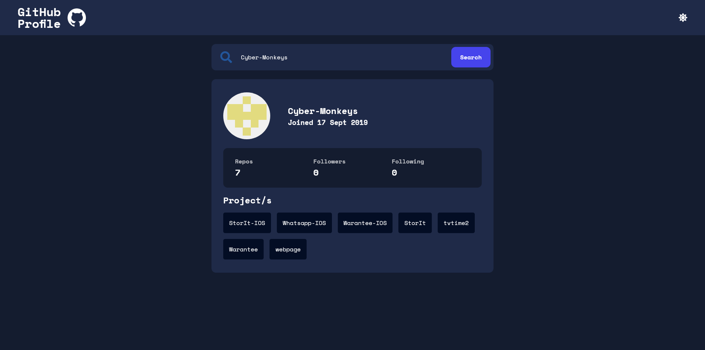
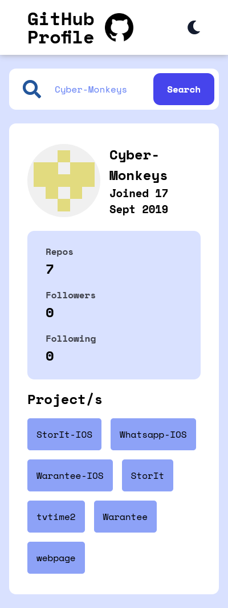
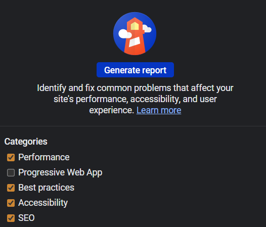
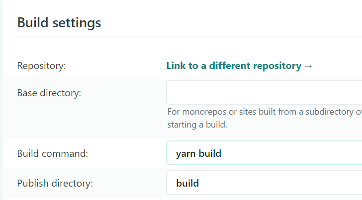

# Test Interview Project - Fidel Lim

## Table of contents

- [Overview](#overview)
  - [The challenge](#the-challenge)
  - [Built with](#built-with)
  - [Links](#links)
  - [Screenshot](#screenshot)
- [Intructions](#instructions)
  - [Setup Development](#setup-development)
  - [Test Project](#test-project)
    - [Lighthouse](#lighthouse)
  - [Run Project](#run-project)
  - [Deploy Project](#deploy-project)
- [Resources](#resources)
- [Author](#author)

## Overview

### The challenge

This test has been designed for you to show us your ability to design, code, test, and document a small service.

### Built with

- **Frontend** - React, SASS
- **Testing** - Lighthouse (Performance, Accessibility, Best Practices, SEO), Jest, React Testing Library
- **Other** - Docker

### Links

- GitHub Repo: [Repo](https://github.com/fidellim/Test-Project-1)
- Live Site URL: [Live Site](https://fidellim-test-project-1.netlify.app/)

### Screenshot

## Instructions

### Setup Development

To setup the project for development, please follow these steps:

1. Download my project as a [zip](https://github.com/fidellim/Test-Project-1) or clone my repository using this command `git clone https://github.com/fidellim/Test-Project-1.git`
2. Once you are on the directory of the project, install all dependencies:
   1. npm: `npm install`
   2. yarn: `yarn install`
3. After that you can start running the project in development server using this command:
   1. npm: `npm start`
   2. yarn: `yarn start`

### Test Project

#### Lighthouse

If you would like to test the app's performance, accessibility, best practices, and SEO, there is Google Lighthouse.

Follow these steps to check the app's performance, accessibility, best practices, and SEO:

1. Use Google Chrome (Incognito Mode) to run the app. It is suggested to use Incognito window as Chrome extensions might negatively affect the page's/app's load performance.
2. Make sure the app is running. You can use `npm/yarn start` for now.
3. Once the app is running in Chrome, right click the app and press "Inspect".
4. Locate and press "Lighthouse". It is usually located at the top section of Chrome Dev Tools. 
5. Then, choose any category that you would want to generate a report. 
6. After a few seconds, your report will be generated. Within this report, Lighthouse will inform you what went wrong and recommend ways to improve your app's performance, accessibility, best practices, and SEO.  

### Run Project

To run the project in a production build, please follow these steps:

`Static server`

1. Make sure you have a build folder for the project.
   1. npm: `npm build`
   2. yarn: `yarn build`
2. Add serve dependency
   1. npm: `npm install -g serve`
   2. yarn: `yarn global add serve`
3. Finally, you can run with this command:
   1. npm/yarn: `npx serve -s build`

`Docker`

### Deploy Project

If you would like to deploy the project, please follow these steps:

1. The platform that I will use and explain is Netlify. You can also use other platforms like [Vercel](https://vercel.com/guides/deploying-react-with-vercel-cra), [Firebase](https://dzone.com/articles/react-apps-firebase), [GitHub Pages](https://dev.to/yuribenjamin/how-to-deploy-react-app-in-github-pages-2a1f), and more.
2. Create an account. If you already have, just login.
3. There are two ways to deploy in Netlify, either through GitHub/GitLab/Bitbucket Continuous Deployment or Drag & Drop Deployment.

`GitHub/GitLab/Bitbucket Continuous Deployment`

1. Press the "New site from Git". Choose any Git repository manager (GitHub/GitLab/Bitbucket) you prefer. Make sure you have the repository of the project on your preferred option.
2. Now that you've connected Netlify and your preferred Git repository manager, choose the repository of the project. Then, configure your settings. Make sure the build command is `npm run build` or `yarn build` and publish directory is `dist` for npm or `build` for yarn.  
3. Wait for a few minutes to build the site. After that you can access the project. 

`Drag & Drop Deployment`

1. This would would be the easier way. All you need is the build folder of the project. Then go to the "Sites" section. Once you are there, drag & drop the folder to the designated place. 
2. After a few seconds/mins, you will be able to access it. 

## Resources

- [Preconnect to required origin](https://www.afasterweb.com/2018/04/11/two-tips-for-using-3rd-party-fonts/) - using `<link>` instead of `@import` for using 3rd-party provider.
- [Front-end Testing](https://css-tricks.com/front-end-testing-is-for-everyone/) - get an overview of the different kinds of testing for front-end.
- [React Testing Tutorial](https://youtu.be/ML5egqL3YFE) - a tutorial on how to test components in React.

## Author

- Website - [Fidel Lim Portfolio](https://fidellim-portfolio.netlify.app/)
- Github - [fidellim](https://github.com/fidellim)
